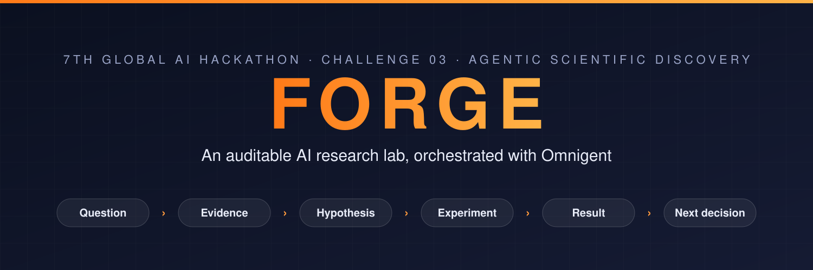
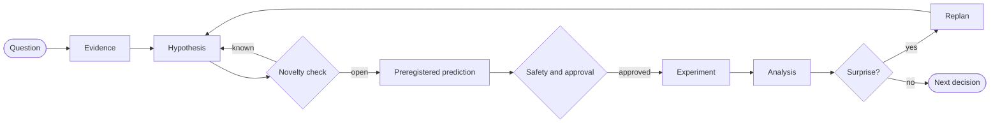
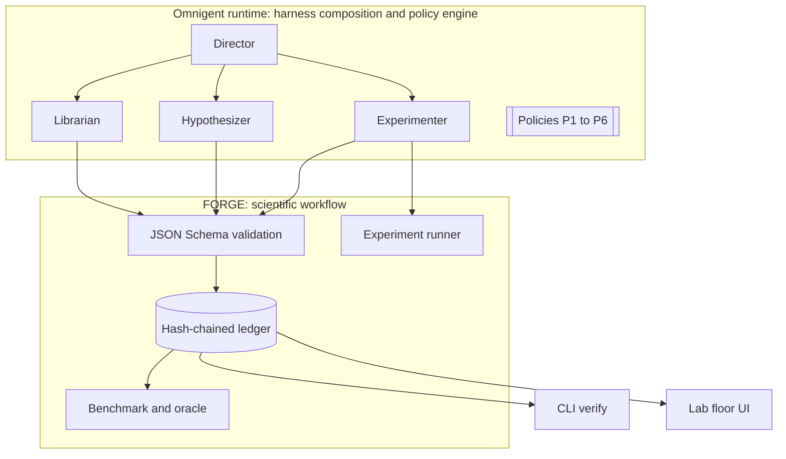

<div align="center">



<br/>
<br/>

<strong>A computational research lab where specialist agents turn one question into cited evidence, a falsifiable hypothesis, a preregistered experiment, and a changed next decision.</strong>

<br/>
<br/>

[](docs/references/reference-02.pdf)
[](docs/references/reference-02.pdf)
[](docs/coordination/OMNIGENT_SMOKE_TEST.md)
[](requirements-science.txt)
[](https://github.com/nothariharan/forge/commits/main)
[](#project-status)

</div>

# FORGE

FORGE is an agentic scientific discovery lab built for **Challenge 03, Agentic Scientific Discovery**, at the Hack-Nation x Databricks **7th Global AI Hackathon**. The challenge asks teams to build an AI lab with [Omnigent](https://omnigent.ai) that makes scientific discovery faster, and to prove it with one complete discovery loop.

FORGE runs that loop as a visible, auditable workflow:

**Question → Evidence → Hypothesis → Preregistered experiment → Result → Updated decision**

Omnigent is the runtime that composes the agents and enforces the policies. FORGE is the scientific workflow on top of it: structured handoffs, a tamper-evident research record, a reproducible experiment runner, and a benchmark that compares the multi-agent lab against a matched single-agent baseline.

> [!IMPORTANT]
> FORGE is a research assistant, not an autonomous authority. Hypotheses written by agents are labeled as AI-generated, findings are provisional, and this README separates what is **verified** from what is **planned**. No benchmark number or scientific claim appears here without a raw artifact in the repository.

## Table of Contents

- [Why FORGE](#why-forge)
- [How FORGE Maps to the Judging Criteria](#how-forge-maps-to-the-judging-criteria)
- [The Discovery Loop](#the-discovery-loop)
- [Architecture](#architecture)
- [Specialist Agents](#specialist-agents)
- [Policies and Human Approval](#policies-and-human-approval)
- [The Research Ledger](#the-research-ledger)
- [Science Track Record](#science-track-record)
- [Benchmark: Single Agent vs FORGE](#benchmark-single-agent-vs-forge)
- [Quick Start](#quick-start)
- [Project Status](#project-status)
- [Repository Layout](#repository-layout)
- [Documentation](#documentation)
- [Responsible Use and Limits](#responsible-use-and-limits)
- [Team](#team)
- [Contributing](#contributing)

## Why FORGE

The bottleneck FORGE attacks is not idea generation. It is the slow, error-prone path from a plausible idea to a result a scientist can trust. Agent-written research tends to fail in the same places:

| Failure mode | What FORGE does about it |
|--------------|--------------------------|
| Citations that do not resolve or do not support the claim | `tools/citation_check.py` resolves DOIs, arXiv IDs and URLs and checks quoted spans. The agent's own "verified" flag is never trusted |
| Hypotheses adjusted after the result is known | A prediction, falsifier, metric and seed are committed to the ledger before the experiment starts |
| Results nobody can reproduce | Every run records dataset version, code hash, seed, environment and raw metrics as machine-readable artifacts |
| Known findings presented as new | A Referee role returns `NOVEL`, `KNOWN`, `CONTRADICTED` or `UNCERTAIN` with prior-art links and search scope |
| A research record that can be quietly edited | Events are append-only and hash-chained, and `cli.verify` detects any tampering |
| Agents acting without oversight | Omnigent policies cap dispatches and route experiment execution to a human for approval |

## How FORGE Maps to the Judging Criteria

The rubric comes from the official challenge brief ([`docs/references/reference-02.pdf`](docs/references/reference-02.pdf), page 4). Each row links to the evidence a judge can open.

| Criterion | Weight | What FORGE shows | Where to look |
|-----------|:------:|------------------|---------------|
| **Omnigent orchestration** | 30% | A director agent routes work across specialists on two different harnesses (Claude and Codex) with structured JSON handoffs. A dispatch budget is enforced by the Omnigent policy engine, not by the prompt | [`omnigent/forge/`](omnigent/forge/), [smoke test](docs/coordination/OMNIGENT_SMOKE_TEST.md) |
| **Breakthrough potential** | 25% | A domain-agnostic lab for the full discovery loop, exercised on NASA exoplanet catalog vetting. Candidate questions are screened against prior art before any claim is made | [Science decision packet](docs/coordination/SCIENCE_DECISION_PACKET.md) |
| **Discovery acceleration and learning** | 20% | A matched single-agent vs multi-agent protocol with stated denominators, budgets, seeds and an oracle. Measured results already changed the team's next decision more than once | [`bench/PROTOCOL.md`](bench/PROTOCOL.md), [Science Track Record](#science-track-record) |
| **Scientific rigor** | 15% | Preregistration before compute, permutation controls, cluster-bootstrap intervals, object-disjoint splits, raw artifacts with SHA-256 of every source response, and withdrawn results kept on record | [Preregistration](docs/coordination/TESS_RESOLUTION_SHIFT_PREREGISTRATION.md), [`schemas/examples/`](schemas/examples/) |
| **Creativity and responsibility** | 10% | AI-generated labels on every agent hypothesis, a human approval gate, a hash-chained audit trail, and honest reporting of null and negative results | [`AGENTS.md`](AGENTS.md), [Ledger](#the-research-ledger) |

## The Discovery Loop



1. **Evidence.** The Librarian retrieves sources and returns claims with resolvable references and quoted spans.
2. **Hypothesis.** The Hypothesizer proposes a claim with a prediction and a falsifier, labeled as AI-generated.
3. **Novelty.** The Referee searches for prior art. A known result is kept as a useful negative outcome and does not consume experiment budget.
4. **Preregistration.** The Planner compares at least two candidate tests on expected learning, feasibility and cost, then commits the prediction distribution, metric and seed before anything runs.
5. **Experiment.** After the safety gate, the Experimenter runs a deterministic computational test and records code hash, data version, seed and metrics.
6. **Analysis and replanning.** The Analyst compares the observation with the committed prediction. A surprising result reopens an earlier assumption and changes what is investigated next.

## Architecture



| Layer | Responsibility | Location |
|-------|----------------|----------|
| Runtime | Agent composition, multi-harness handoff, policy enforcement | [`omnigent/`](omnigent/) |
| Contracts | Event envelope and per-event payload schemas | [`schemas/`](schemas/) |
| Record | Append-only, hash-chained SQLite ledger with replay and export | [`core/ledger.py`](core/ledger.py) |
| Science | Deterministic experiment runner and reproducible data audits | [`tools/`](tools/) |
| Evaluation | Baseline arm, oracle, statistics and report generation | [`bench/`](bench/) |
| Consumers | Read-only CLI and UI over ledger events | [`cli/`](cli/), [`ui/`](ui/) |

The UI and CLI only read events. Agents never write directly to UI state, so everything a viewer sees can be reconstructed from the ledger.

## Specialist Agents

Each agent owns one scientific decision and hands off structured JSON that is validated at the boundary.

| Agent | Decision it owns | Output | Status |
|-------|------------------|--------|--------|
| **Director** | Which specialist acts next | Dispatches and inbox reads | Running in Omnigent (`claude-sdk`) |
| **Librarian** | Which sources support a claim | `EvidencePacket` | Running in Omnigent (`claude-sdk`) |
| **Hypothesizer** | What is worth testing | `Hypothesis` | Running in Omnigent (`codex`) |
| **Experimenter** | How a test is executed | `RunRecord` | Running in Omnigent (`claude-sdk`) |
| **Referee** | Whether a hypothesis is already known | `NoveltyVerdict` | Interface draft |
| **Planner** | Which experiment to run under the budget | `ExperimentSpec` | Interface draft |
| **Analyst** | What the result means | `Finding` | Interface draft |
| **Safety** | Whether an action needs human approval | `Gate` | Interface draft |

Role definitions live in [`agents/`](agents/) and the runnable graph lives in [`omnigent/forge/`](omnigent/forge/).

## Policies and Human Approval

| ID | Policy | Purpose | Status |
|----|--------|---------|--------|
| P1 | Citations | Block claims whose references do not resolve | Scaffold |
| P2 | Budget | Hard cap on specialist dispatches per run | **Enforced by the Omnigent engine.** Dispatches 1 to 3 allowed, dispatch 4 denied |
| P3 | Preregistration | No experiment without a committed prediction | Scaffold. The benchmark report already checks event order |
| P4 | Novelty | Known findings do not consume experiment budget | Scaffold |
| P5 | Sandbox | Resource limits and network allowlists for execution | Scaffold |
| P6 | Human approval | Every experiment command pauses for a human decision | Configured as `ASK`. Approval card in the web UI not yet confirmed |

Scaffolds in [`policies/`](policies/) describe intent only and are not claimed as active controls. Details and observed output are in the [Omnigent smoke test](docs/coordination/OMNIGENT_SMOKE_TEST.md).

## The Research Ledger

Every decision in a run is one event in an append-only SQLite log. Each event stores the hash of the previous one, so a single edited value breaks the chain from that point on.

```text
hash = sha256(prev_hash + canonical_json(event_without_hash))
```

<details>
<summary><strong>Event envelope</strong></summary>

<br/>

| Field | Set by | Notes |
|-------|--------|-------|
| `schema_version` | ledger | `"1.0"` |
| `seq` | ledger | Starts at 1 and increases by 1 within a `run_id` |
| `ts` | ledger | ISO-8601 UTC timestamp |
| `run_id` | caller | Run the event belongs to |
| `agent` | caller | `librarian`, `hypothesizer`, `referee`, `planner`, `experimenter`, `analyst`, `safety` or `system` |
| `type` | caller | One of the 17 event types below |
| `refs` | caller | Optional cross-references such as `hid`, `eid`, `gate_id` |
| `payload` | caller | Validated against the JSON Schema for its `type` |
| `ai_generated` | caller | Marks agent-authored content |
| `prev_hash` | ledger | Hash of the previous event, or `GENESIS` for the first |
| `hash` | ledger | SHA-256 over the previous hash and the canonical event |

</details>

<details>
<summary><strong>Event types</strong></summary>

<br/>

| Stage | Events |
|-------|--------|
| Run lifecycle | `RUN_CREATED`, `RUN_COMPLETED`, `ERROR` |
| Evidence and hypotheses | `EVIDENCE_ADDED`, `HYPOTHESIS_PROPOSED`, `NOVELTY_VERDICT` |
| Planning | `PREDICTION_COMMITTED`, `EXPERIMENT_SELECTED` |
| Execution | `RUN_STARTED`, `RUN_FINISHED` |
| Analysis | `FINDING`, `CONSENSUS`, `SURPRISE`, `REPLAN` |
| Governance | `POLICY_DENIED`, `GATE_OPENED`, `GATE_RESOLVED` |

</details>

An invalid payload raises a validation error and writes nothing. Full payload reference with examples: [`LEDGER.md`](LEDGER.md).

## Science Track Record

The provisional domain is **exoplanet catalog vetting** using public NASA Exoplanet Archive tables. The research question is not locked yet. What the repository already shows is the loop the challenge asks for: a measured result changing the next decision, including decisions to withdraw and to close.

| # | What was tested | Result | Decision it changed |
|---|-----------------|--------|---------------------|
| 1 | OpenML Adult task 7592: missing-value handling, 9 candidates, official 10 folds, seed 1 | Runner validated end to end in 165.3 s. Prior-art screen found the question already studied | Adult retired as a science question and kept only as the runner and ledger integration task |
| 2 | First exoplanet precision-transfer analysis | **Withdrawn.** It treated `CANDIDATE` as confirmed-planet truth and reused training objects in its temporal score | Replaced by a descriptive catalog audit with a fixed censoring rule |
| 3 | Kepler label-availability audit across seven catalog releases | Confirmed class grew by 13 objects (+0.48%) while the catalog grew 30.2%. Largest usable confirmed cohort is 28 objects against a 200 per class minimum | **Kepler closed** as a planet-outcome target |
| 4 | TESS reference-standard audit (host cross-match to confirmed planets) | 88.7% of `CP` hosts match, against 0.23% of the `FP` control | Labels fixed: `CP` positive, `KP` excluded, `FA` counted as negative, split grouped by host star |
| 5 | Prior-art review of TESS candidate classification | Overlaps published work on Kepler and TESS transfer | Plain classification dropped. Direction narrowed to a resolution-bias audit |
| 6 | Preregistered smoke test T1: can catalog fields separate resolved from unresolved TOIs? | Out-of-fold ROC AUC **0.7616**, 95% cluster-bootstrap CI [0.7492, 0.7737]. Permutation control mean 0.4973 | Prediction supported, falsifier not triggered. Scope limited after a post-run review |

Every row is reproducible from a script in [`tools/`](tools/) and backed by a raw artifact in [`schemas/examples/`](schemas/examples/) that stores retrieval timestamps and SHA-256 hashes of the source responses.

> [!NOTE]
> Row 6 measures separability in the **current** catalog snapshot only. It is not a triage-time shift measurement, not an accuracy gap, and not a discovery. The full reasoning, limits and open gates are in the [science decision packet](docs/coordination/SCIENCE_DECISION_PACKET.md) and the [science contract](docs/coordination/SCIENCE_CONTRACT.md).

## Benchmark: Single Agent vs FORGE

The claim under test: on the locked question and a matched budget, does the FORGE multi-agent harness produce a better or faster research loop than one plain agent?

| Arm | Description |
|-----|-------------|
| **A: baseline** | One agent, one session, plain prompt, same tools and runner |
| **B: FORGE** | Full specialist graph through Omnigent with policies P1 to P6 |
| C1 to C3 | Optional ablations: no Referee, random-order Planner, single Analyst |

- Same model, tools, data, budget and seed list in both arms. FORGE's extra coordination tokens count against its own budget.
- Every metric states its numerator and denominator. Timing runs from `RUN_CREATED` to `RUN_COMPLETED` and excludes setup.
- An oracle runs every candidate on every seed to provide ground truth for decision correctness.
- An experiment only counts as valid if its prediction was committed before it started.
- Failed and censored episodes are reported, never dropped.

**No A vs B result exists yet, and none is claimed.** The protocol stays a draft until the science question is locked, and it is frozen before any comparative run. The challenge brief asks teams to report the improvement they actually observe, so FORGE will report the measured ratio with its uncertainty and cost, including the case where the multi-agent arm is slower or worse. See [`bench/PROTOCOL.md`](bench/PROTOCOL.md).

## Quick Start

### Requirements

| Tool | Version | Needed for |
|------|---------|------------|
| Python | 3.12 | Everything |
| [Omnigent](https://omnigent.ai) | 0.16.0 | Running the agent graph |
| Claude and Codex subscriptions | configured through `omni setup` | Agent harnesses. No API keys are stored in the repository |

### 1. Install

```bash
git clone https://github.com/nothariharan/forge.git
cd forge
python -m venv .venv
.venv/bin/pip install -r requirements.txt
```

On Windows, use `.venv\Scripts\pip` and `.venv\Scripts\python` in place of the `.venv/bin/` paths.

### 2. Replay a full research loop and verify the record

This writes a 31 event sample run through the real ledger. The run is a labeled fixture, so every number and citation in it is made up.

```bash
.venv/bin/python -m core.fake_events --run-id demo --delay 0.5
.venv/bin/python -m cli.verify demo
```

Expected output:

```text
run 'demo': chain OK, 31 events
```

### 3. Run the tests

```bash
.venv/bin/pip install -r requirements-science.txt
.venv/bin/python -m pytest -q
```

The science requirements are only needed by the TESS shift test and the experiment tools. The remaining tests run on `requirements.txt` alone.

### 4. Run the agent graph

```bash
omni setup              # once, to connect the harnesses
omni run omnigent/forge
```

### 5. Reproduce the science audits

```bash
python tools/audit_exo_target_feasibility.py --output results/exo-target-feasibility.json
python tools/audit_tess_reference_standard.py --output results/tess-reference-standard.json
python tools/tess_resolution_shift.py --output results/tess-resolution-shift.json
```

These fetch live tables from the NASA Exoplanet Archive, so counts can differ from the stored artifacts in [`schemas/examples/`](schemas/examples/) as the archive updates. Compare reruns using the recorded timestamps and hashes. They need the science requirements from step 3.

<details>
<summary><strong>Benchmark tooling</strong></summary>

<br/>

```bash
# Ground truth for every candidate on every seed
python bench/oracle.py <spec.json> --out results/bench/<bench_id>

# Launch one baseline episode (add --dry-run to inspect it first)
python bench/launch_arm_a.py --spec <spec.json> --seed <n> --episode results/bench/<bench_id>/A/seed-<n>

# Compute every metric from the raw episode artifacts
python bench/report.py results/bench/<bench_id>

# Check that cited references resolve
python tools/citation_check.py <refs.json | report.md> -o citations.json
```

</details>

## Project Status

Status as of 2026-10-04. The complete FORGE workflow is not yet runnable end to end.

| Area | Verified in `main` | Still open |
|------|--------------------|------------|
| **Core** | Hash-chained ledger, payload schemas for all 17 event types, 31 event sample run, verify CLI | SSE server, full `forge` CLI (`run`, `status`, `tail`, `replay`) |
| **Orchestration** | Omnigent 0.16.0 graph, Claude to Codex handoff, P2 denial enforced by the engine | P6 approval confirmed in the UI, enforced handoff validation, agent events written to the ledger |
| **Science** | Ten-fold experiment runner, Kepler and TESS audits, preregistered T1 smoke test | Locked research question, prior-art search on the resolution-bias question |
| **Benchmark** | Protocol v0.1, oracle, baseline arm and launcher, statistics, report generator | Frozen protocol, arm B runner, A vs B result |
| **UI** | Direction and demo contract documented | Lab floor UI, in progress on the `ui/lab-floor` branch |

## Repository Layout

```text
forge/
├── agents/           Role definitions for the seven specialists
├── omnigent/         Omnigent agent graph and policy configuration
├── policies/         Policy intent for P1 to P6
├── core/             Ledger, schema validation, sample run generator
├── schemas/          Event envelope, payload schemas, raw result artifacts
├── tools/            Experiment runner, data audits, citation checker
├── bench/            Protocol, baseline arm, oracle, statistics, report
├── cli/              Ledger verification entry point
├── ui/               UI direction and demo contract
├── tests/            Pytest suite
├── results/          Reproducible run artifacts
└── docs/             Plan, coordination notes, challenge brief, sources
```

## Documentation

| Document | What it covers |
|----------|----------------|
| [Challenge brief](docs/references/reference-02.pdf) | Official Challenge 03 requirements and rubric |
| [Project plan](docs/PROJECT_PLAN.md) | Implementation plan, phase gates and evidence standards |
| [Contributor and agent guide](AGENTS.md) | Lanes, stable contracts and integrity rules |
| [Ledger reference](LEDGER.md) | Envelope, event types and payload examples |
| [Science decision packet](docs/coordination/SCIENCE_DECISION_PACKET.md) | Target audits, tables and open gates |
| [Science contract](docs/coordination/SCIENCE_CONTRACT.md) | Question status, label rules and reproduction notes |
| [T1 preregistration](docs/coordination/TESS_RESOLUTION_SHIFT_PREREGISTRATION.md) | Prediction, falsifier and post-run correction |
| [Benchmark protocol](bench/PROTOCOL.md) | Arms, metrics, budget, seeds and analysis |
| [Omnigent smoke test](docs/coordination/OMNIGENT_SMOKE_TEST.md) | Environment, config format and observed results |
| [Coordination board](docs/coordination/WORKSTREAMS.md) | Lane owners and current status |
| [UI direction](ui/README.md) | Visual direction and demo path |
| [Source index](docs/SOURCE_INDEX.md) | Provenance of supplied documents |

## Responsible Use and Limits

- Experiments are computational only and use public datasets and approved tools.
- Agent-generated hypotheses and conclusions are marked `ai_generated` in the ledger and must not be described as discoveries.
- A novelty verdict reports what was found in the searched sources. It is not proof of novelty.
- Archive dispositions are the catalog's own best-knowledge adjudications, not ground truth.
- Hash chaining detects modification relative to a trusted head. It does not prove who created an event.
- Consequential actions and final recommendations require human approval, and any finding needs expert validation before real-world use.

## Team

| Member | Lane |
|--------|------|
| Hari ([@nothariharan](https://github.com/nothariharan)) | Science and planner |
| Akshat ([@aksbhaskar](https://github.com/aksbhaskar)) | Benchmark, rigor and core |
| Saksham | Orchestration and product UI |
| Ish | Core and CLI |

## Contributing

Work happens in shared lanes and reaches `main` only through reviewed pull requests.

| Lane | Branch | Scope |
|------|--------|-------|
| Orchestration | `work/orchestration` | Omnigent, specialist agents, policies |
| Science | `work/science` | Research question, experiment tools, planner |
| Benchmark | `work/benchmark` | Baseline, metrics, rigor, submission evidence |
| Core and UI | `work/core-ui` | Schemas, ledger, event server, CLI, UI |

- Coordinate before changing `schemas/event.schema.json`, since it is the boundary between producers and consumers.
- Each pull request states the problem, the files changed, the commands run with their observed output, and the limitations.
- Never commit credentials, fabricated numbers or hand-edited results.

See [`AGENTS.md`](AGENTS.md) for the full working agreement.

<div align="center">

<br/>

Built for the Hack-Nation x Databricks 7th Global AI Hackathon, Challenge 03: Agentic Scientific Discovery.

</div>
